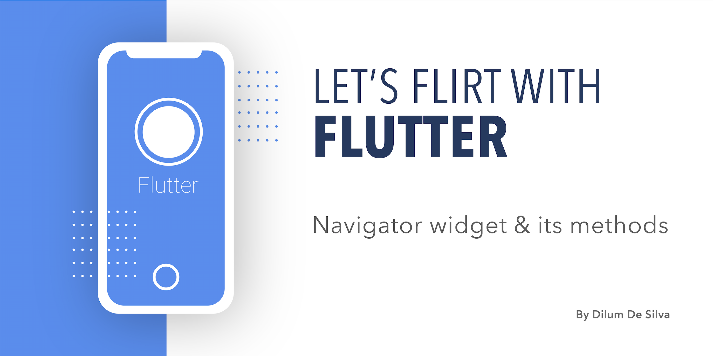

## Flutter Navigation 

Under flutter navigation we will be disscussing following sub topics.

 1. How screens are stacked in Flutter.
 2. How to navigate to a screen and how to navigate to the previous screen.
 3. How to send data back and forth while navigating among screens.

### 1. How screens are stacked in Flutter
In flutter we identify screens as **'routes'** so, if we are talking about the home screen or the first screen, we are refering to the first route or the initial route of our application. 

Flutter has provided **[navigator widget](https://api.flutter.dev/flutter/widgets/Navigator-class.html)** and its methods to naviagate among screens. Furthermore in flutter **navigator widget** maintains all the **routes** (screens) as stack. Also, as we all know stacks follow the concept of **LIFO** /Last In First Out. In Flutter also we have the same concept to manage the screens/routes stack

Basically, when you lunch the **first screen or route in Flutter**, In case of **android this route is know as activity** and in **iOS** it is known as **ViewController**.

